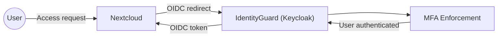
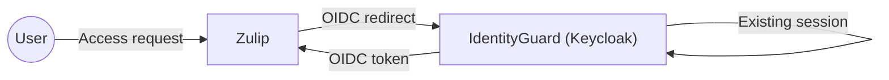
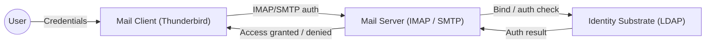

# Architecture

This Proof of Concept uses a layered hub-and-spoke model.

IdentityGuard is composed of two distinct layers:

- A directory service acting as the authoritative identity substrate
- An identity broker (Keycloak) responsible for authentication, authorization and policy enforcement

All connected services delegate identity and access decisions either to the identity broker (OIDC/SAML)
or directly to the directory, depending on protocol capabilities.

The architecture is intentionally minimal to highlight trust boundaries,
dependency direction and audit flows.

## Authentication & Trust Flow

## Primary Authentication Flow (Nextcloud)

## Single Sign-On Flow (Zulip)

## Mail Authentication & Trust Flow

## Identity substrate (Directory / LDAP)

The Identity & Access domain is grounded in a directory service that acts as the
authoritative identity substrate.

### Responsibilities
- User and group storage
- Credential storage
- Identity lifecycle (enable, disable, delete)
- Attribute ownership

This layer is the single source of truth for identity.

---

## Identity broker and policy layer (Keycloak)

An identity broker consumes the directory to provide higher-level identity services.

Responsibilities:
- Single Sign-On
- Multi-factor authentication
- Authentication flows
- Protocol translation (OIDC, SAML)
- Centralized access policy enforcement

The broker never owns identity data.
It derives all user, group and credential information from the identity substrate.

## Identity consumption model

Different classes of systems consume identity through different interfaces:

- Web-based applications (Nextcloud, Zulip) authenticate via the identity broker using OIDC
- Non-web and system-level services (mail, VPN, PAM) authenticate directly against the directory
- No consuming system manages its own user lifecycle

This model ensures consistent identity enforcement across both modern and legacy protocols.

© 2026 Nidax / True North