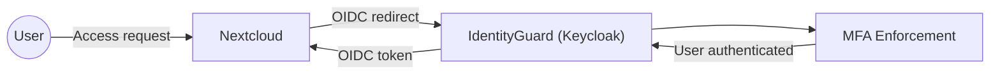
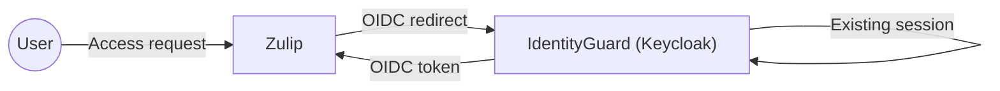

# Architecture

This Proof of Concept uses a simple hub-and-spoke model.

IdentityGuard (Keycloak) acts as the central authority for authentication
and authorization. All connected services delegate identity and access
decisions to this central layer using OpenID Connect.

Nextcloud and Zulip function as independent service providers (spokes).
They do not manage user identities themselves and do not trust each other;
they only trust IdentityGuard.

The architecture is intentionally minimal to highlight trust boundaries,
dependency direction and audit flows.

## Authentication & Trust Flow

## Primary Authentication Flow (Nextcloud)

## Single Sign-On Flow (Zulip)

## Directory access (LDAP projection)

In addition to modern identity protocols, the Identity & Access domain exposes a **directory interface via LDAP** to support systems that cannot consume OIDC or SAML.

### Purpose
LDAP is provided as a **read-only projection** of centrally managed identities for system-level integrations.

Typical consumers:
- Mail servers (e.g. SMTP/IMAP authentication)
- Unix/PAM authentication
- Legacy or infrastructure tooling
- Address book lookups

### Architectural role

IdentityGuard (Keycloak) remains the **authoritative identity source**.

- User lifecycle is managed in the IdP
- Groups and attributes are defined centrally
- LDAP exposes a scoped view of this data

### Constraints
- LDAP is not a source of truth
- No user or group lifecycle is managed via LDAP
- No write-back from consuming systems
- Access is scoped and audited

### Trust boundary
LDAP is treated as an **integration interface**, not as an identity provider.

This ensures compatibility with legacy systems without compromising the autonomy or replaceability of the identity layer.

© 2025 Nidax / True North