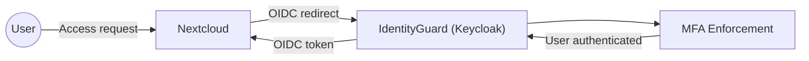
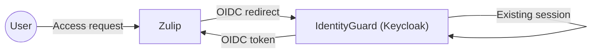

# Architecture

This Proof of Concept uses a simple hub-and-spoke model.

IdentityGuard (Keycloak) acts as the central authority for authentication
and authorization. All connected services delegate identity and access
decisions to this central layer using OpenID Connect.

Nextcloud and Zulip function as independent service providers (spokes).
They do not manage user identities themselves and do not trust each other;
they only trust IdentityGuard.

The architecture is intentionally minimal to highlight trust boundaries,
dependency direction and audit flows.

## Authentication & Trust Flow

## Primary Authentication Flow (Nextcloud)

## Single Sign-On Flow (Zulip)

© 2025 Nidax / True North